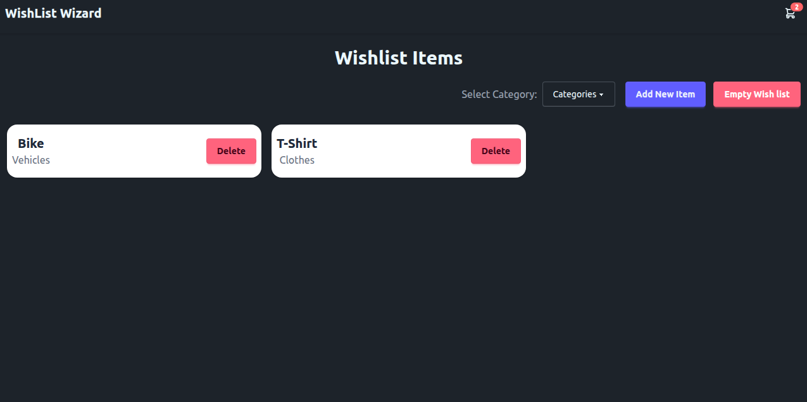

{{ ... }}

## 📦 Installation

```bash
# Clone the repository
git clone https://github.com/Abhijeet43/wishlist-wizard.git

# Navigate to the project directory
cd wishlist-wizard

# Install dependencies
npm install

# Start the development server
npm run dev
```

{{ ... }}

## 📸 Screenshots

### Wishlist Wizard



{{ ... }}

## 🔗 Links

- [GitHub Repository](https://github.com/Abhijeet43/wishlist-wizard)
- [Live Demo][LIVE_DEMO_URL]

{{ ... }}
